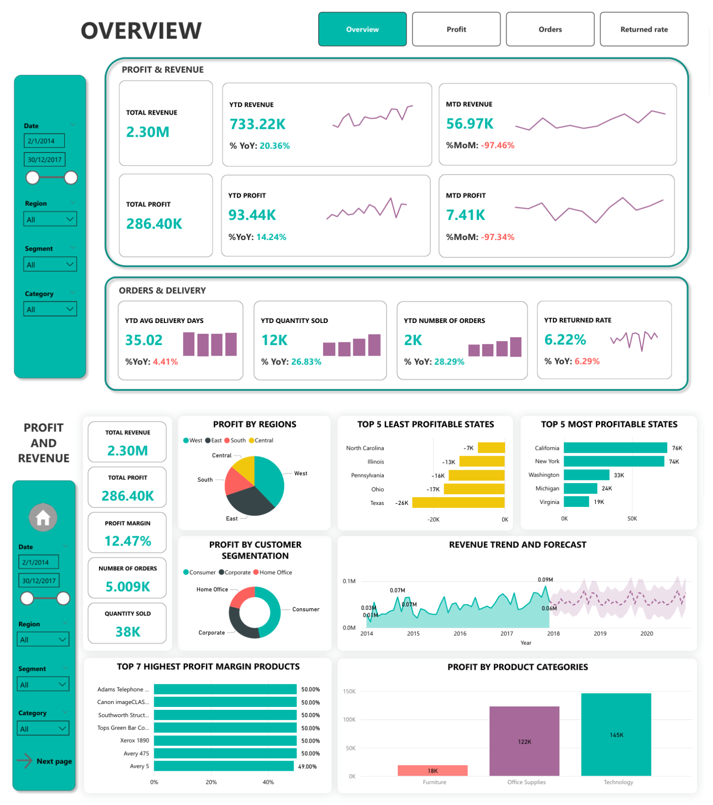
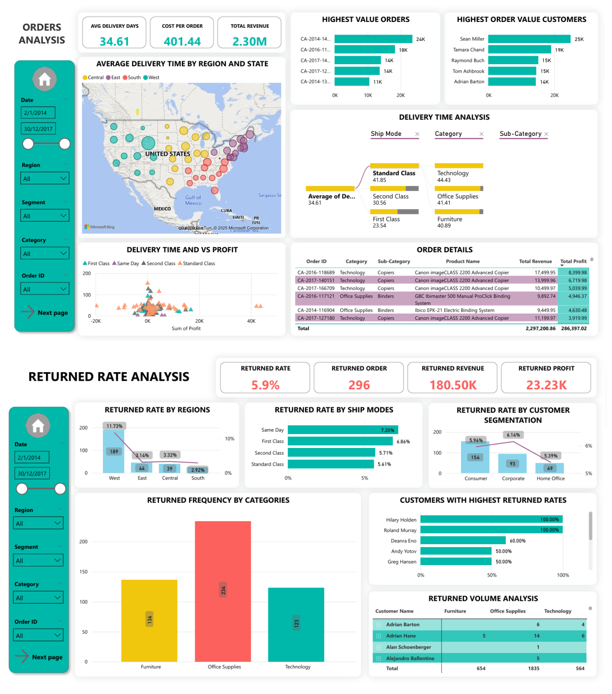

# MAZ_TheAnalystChallenge25
A Sales &amp; Supply Chain PowerBi dashboard submitted for The Analyst Challenge and key insights from the dashboard  

**1/ Approach:**  
From the dataset, divide the into 3 main aspects that needs to be analyzed:  
- Sales (Profit & Revenue)
- Orders & Delivery time
- Returned rate (Possible root causes)

**2/ Dashboard UI:**  

**2/ Key Insights:**  

**Sales:**  
- Increasing trend in revenue yearly. Peak sales were usually at quarter 4, especially in November.
- Top 5 highest revenue states were California, Washington (West region); New York (East), Virginia (South) and Michigan (Central). West regions in general was most profitable (37.86% total profit)
- Top 5 lowest revenue states were Texas, Illinois (Central);Ohio, Pennsylvania (East); North Carolina (South)
Most profitable customer segmentation was Consumers (46.83%)
- 5 out of 6 products with highest product margin belong to Office Suppliers category; however most profitable category was Technology
- The average product margin of Furniture was only 2.45%
  
**Orders and delivery:**    
- The average delivery time is 34.61 days, with slowest deliveries were in Central region (36.98 days)
- 4 out of 5 orders with highest revenue used Standard Class shipping (avg delivery time 41.85, which is the slowest shipping mode), this may be due to the low shipping cost. Standard Class was also the top choice in most states.
- Machines was the sub-category which longest average delivery time, while Phones was the fastest
- The highest revenue order was actually profit negative, the 2 items contributed to this belonged to Technology category and Machines sub-cate. This order used - - First Class shipping, this may suggest the cost for shipping Machines via this most is not efficient
- 3 out of 5 highest value orders contained Copiers products, which are highly profitable regardless using First Class or Standard Class mode.
  
**Returned rate:**  
- West region had highest return rate (11.73%), while South had lowest returned rate (2.92%)
- Same Day shipping mode had highest rate while Standard class is lowest → short delivery may affect product quality
- Corporates were most likely to return orders (6.14%)
- Office Supplies were most returned (234 times). This category also had highest returned quantity (1835 items)
- Binders and Paper were returned 108 and 99 times, respectively, highest among all sub-categories
→ Small items may be affected by delivery process
